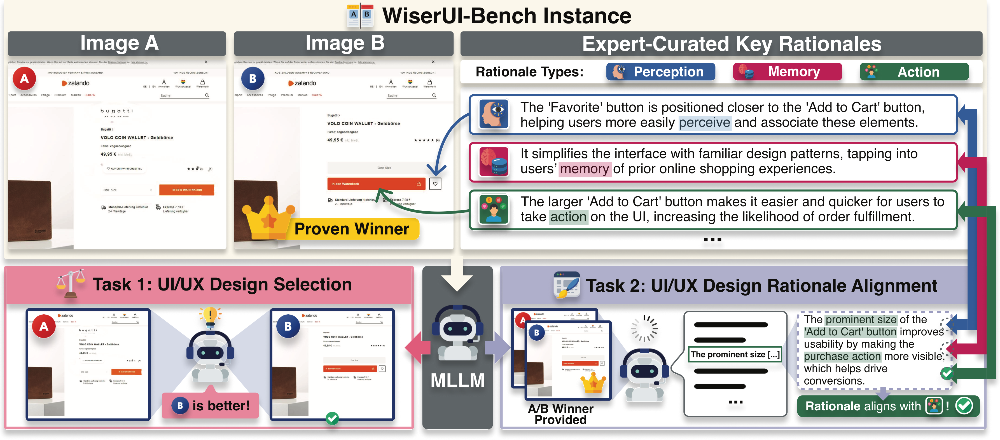

# WiserUI-Bench

<h2 align="center">
  Do MLLMs Capture How Interfaces Guide User Behavior? 
  A Benchmark for Multimodal UI/UX Design Understanding
</h2>

## Abstract
User interface (UI) design goes beyond visuals, guiding user behavior and overall user experience (UX). Strategically crafted interfaces, for example, can boost sign-ups and drive business sales, underscoring the shift toward UI/UX as a unified design concept. While recent studies have explored UI quality evaluation using Multimodal Large Language Models (MLLMs), they largely focus on surface-level features, overlooking behavior-oriented aspects. To fill this gap, we introduce WiserUI-Bench, a novel benchmark for assessing models' multimodal understanding of UI/UX design. It includes 300 diverse real-world UI image pairs, each consisting of two design variants A/B-tested at scale by actual companies, where one was empirically validated to steer more user actions than the other. Each pair is accompanied one or more of 684 expert-curated rationales that capture key factors behind each winning design's effectiveness, spanning diverse cognitive dimensions of UX. Our benchmark supports two core tasks: (1) selecting the more effective UI/UX design by predicting the A/B test verified winner and (2) assessing how well a model, given the winner, can explain its effectiveness in alignment with expert reasoning. Experiments across several MLLMs show that current models exhibit limited nuanced reasoning about UI/UX design and its behavioral impact. We believe our work will foster research in UI/UX understanding and enable broader applications such as behavior-aware interface optimization.

## Dataset
- `images`: 300 UI image pairs. Each pair includes `win.png` (winner version in actual A/B testing results) and `lose.png` (the opposite).
- `WiserUI_Bench.json`: Metadata for 300 UI image pairs. Includes source website link, categories, and expert-curated key rationales.

## License

This dataset is released under the [CC BY-NC-SA 4.0](https://creativecommons.org/licenses/by-nc-sa/4.0/) license.  
It may be used for **non-commercial research purposes**, with proper attribution. Any derivatives must carry the same license.