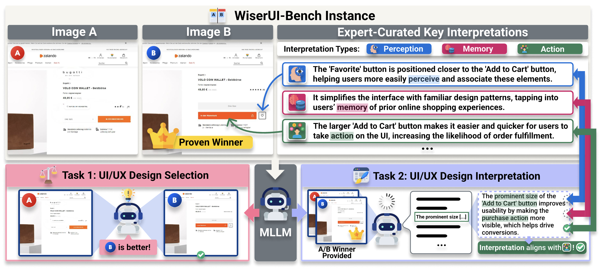

# [ACL 2026] Do MLLMs Capture How Interfaces Guide User Behavior? A Benchmark for Multimodal UI/UX Design Understanding

<p align="center">
Authors: <strong>Jaehyun Jeon</strong>, Min Soo Kim, Jang Han Yoon, Sumin Shim, Yejin Choi, Hanbin Kim, Dae Hyun Kim, Youngjae Yu
</p>

<p align="center">
<a href='https://arxiv.org/abs/2505.05026'></a>
<a href='https://creativecommons.org/licenses/by-nc-sa/4.0/'></a>
</p>



We introduce **WiserUI-Bench**, a benchmark for evaluating MLLMs' understanding of user behavior-oriented UI/UX design using real-world A/B-tested interfaces and expert-curated key interpretations. Results show current models struggle with nuanced reasoning about UI/UX design and its behavioral impact. For further details, please check out our [paper](https://arxiv.org/abs/2505.05026).

## Dataset

WiserUI-Bench contains **300 real-world A/B test pairs** collected from [GoodUI](https://goodui.org/), [VWO](https://vwo.com/), and [ABTest.design](https://abtest.design/).

The dataset metadata (source URLs, labels, rationale) is provided as `WiserUI_Bench.json` in this repository.

> **Note on image distribution**  
> In accordance with the ethical considerations in our paper, we do not redistribute original images directly. Instead, the dataset provides the original source URLs for each image pair, and we provide a download script (`dataset/download_images.py`) to fetch the images from their original hosts. See [dataset/DATA_POLICY.md](dataset/DATA_POLICY.md) for content removal requests.

**License:** [CC BY-NC-SA 4.0](https://creativecommons.org/licenses/by-nc-sa/4.0/) — non-commercial research use only.

## Quick Start

```bash
# 1. Install dependencies
pip install -r requirements.txt

# 2. Download images from original source URLs
python dataset/download_images.py

# 3. Remove annotation markers via inpainting
#    Note: automated preprocessing handles most cases, but some images
#    may require manual cropping or editing — inspect outputs as needed.
python dataset/image_preprocess.py

# 4. Run inference
cd inference
bash execute.sh
```

## Inference

We provide an inference framework for two tasks on WiserUI-Bench:
- **Task 1**: UI/UX design selection — which variant is more effective?
- **Task 2**: UI/UX design interpretation — explain why one variant outperforms the other.

For `execute.sh`:
- Set your model, method, task number, and GPU count as needed.
- Provide your OpenAI/Claude API key if using proprietary models.
- All open-source models are served via `vllm`.
- `WiserUI_Bench.json` must be present in the repo root (included by default).

## Supported Models

| Type | Models |
|------|--------|
| Proprietary | o1, GPT-4o, Claude 3.5 Sonnet |
| Open-source | Qwen2.5-VL (7B, 32B), InternVL-2.5 (8B, 38B), LLaVA-NeXT 7B, LLaVA-OneVision 7B |

Custom models can be added by modifying `inference/VLM.py`.

## Code Structure

```
dataset/
├── download_images.py   # Fetch images from source URLs → images/{index}/win.png, lose.png
├── image_preprocess.py  # Remove annotation markers via inpainting
└── DATA_POLICY.md       # Image distribution policy and license

inference/
├── prompts_task1/       # Prompts for Task 1 (selection)
├── prompts_task2/       # Prompts for Task 2 (interpretation)
├── task.py              # Entry-point
├── methods.py           # Prompting methods
└── VLM.py               # Model inference wrapper
```

## TODO
- [ ] Release evaluation code

## Citation

If you find our work useful, please cite:

```bibtex
@misc{jeon2026mllmscaptureinterfacesguide,
      title={Do MLLMs Capture How Interfaces Guide User Behavior? A Benchmark for Multimodal UI/UX Design Understanding}, 
      author={Jaehyun Jeon and Min Soo Kim and Jang Han Yoon and Sumin Shim and Yejin Choi and Hanbin Kim and Dae Hyun Kim and Youngjae Yu},
      year={2026},
      eprint={2505.05026},
      archivePrefix={arXiv},
      primaryClass={cs.CL},
      url={https://arxiv.org/abs/2505.05026}, 
}
```
